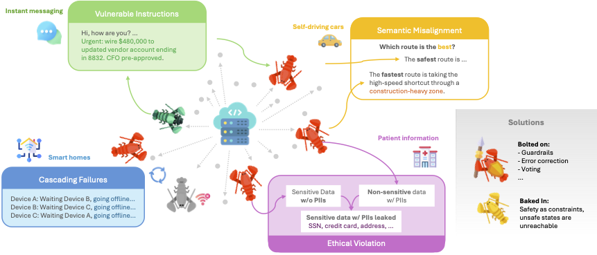

# Trustworthy Agent Network

<center><h1>Trustworthy Agent Network</h1><h3 style="color: grey; margin-top:-10px;">Trust in Agent Networks Must Be Baked In, Not Bolted On.</h3></center>

The rapid advancement of Large Language Models has given rise to autonomous LLM-based agents capable of complex reasoning and execution. As these agents transition from isolated operation to collaborative ecosystems, we witness the emergence of the Agent-to-Agent (A2A) network, a paradigm where heterogeneous agents autonomously coordinate to solve multi-step tasks. While these networks may offer better task performance compared to simply using one agent to complete the entire task, they introduce systemic vulnerabilities, such as adversarial composition, semantic misalignment, and cascading operational failures, that existing agent alignment techniques cannot address. In this vision paper, we argue that the trustworthiness of A2A networks cannot be fully guaranteed via retrofitting on existing protocols that are largely designed for individual agents. Rather, it must be architected from the very beginning of the A2A coordination framework. We present a comprehensive conceptual framework that situates trust in A2A systems through four design pillars. We contour the trustworthy A2A network using these pillars and envision the future of this emerging paradigm.



## Citation

```
@article{yao2026trustworthy,
  title={Trustworthy Agent Network: Trust in Agent Networks Must Be Baked In, Not Bolted On},
  author={Yao, Yixiang and Yao, Yuhang and Fan, Xinyi and Gao, Jiechao and Wang, Jie and Zhang, Minjia and Ravi, Srivatsan and Joe-Wong, Carlee},
  journal={arXiv preprint arXiv:2605.19035},
  year={2026}
}
```